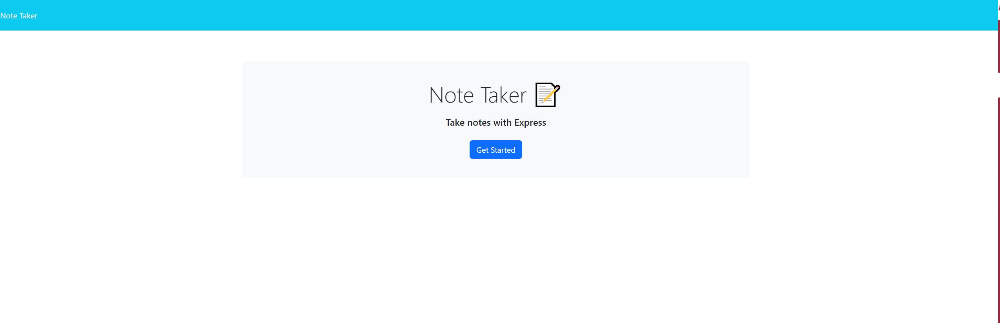

# Note Taker App

## Description

I made this project to give me a central location to conveniently store notes for class or other important topics. This solves the issue of 'oh where did i write this note?' when all i have to  do is open the website and boom there's all my notes. In the making of this project I learned how the backend and the front end work together to create a fully funcitonal battlestation.

## Installation

N/A

## Screenshot

### deployed page --> https://fast-lake-60383-3708abbf20ef.herokuapp.com/

## Usage

Click 'Get Started' this will take you to the actual note section of the website. once there you may enter a title indicated by 'Note Title' and content indicated by 'note text'. you will not be able to save the note until both title and text area  have entered text. you can also click 'clear form' to remove text that was entered.  once a note is saved it can be viewed in the sidebar on the left side of the page. you can also click the red trash can icon to delete the offending note in question.

## License

MIT License

https://opensource.org/licenses/MIT

## Contributions

N/A
